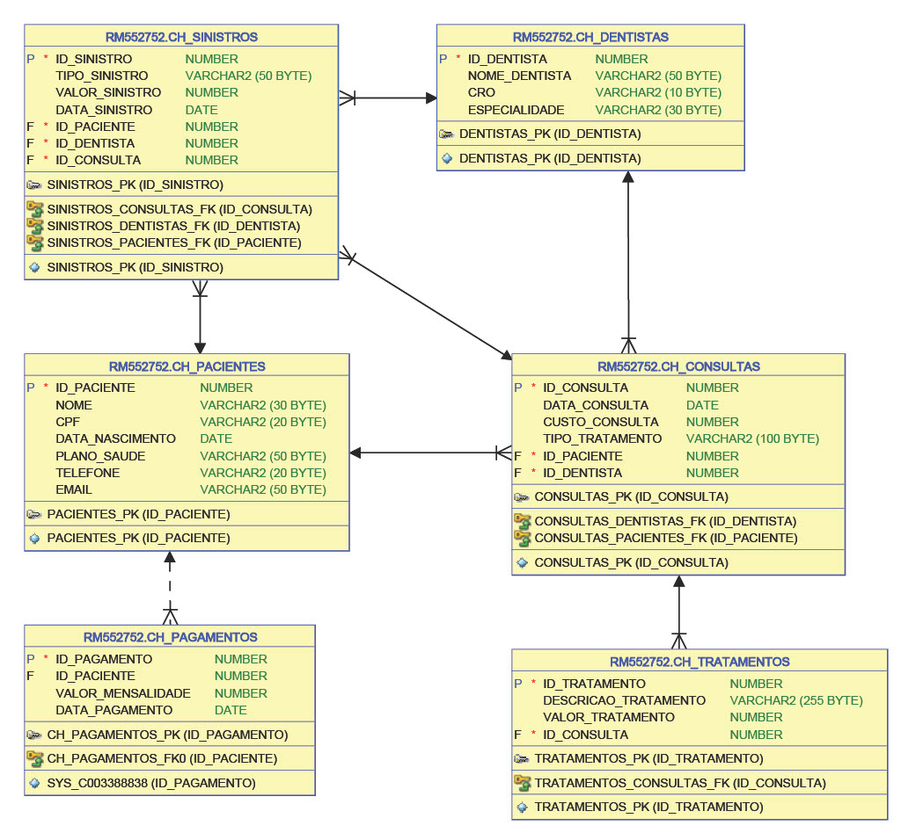

# Sinister Buster Definitive

## 3.1 Nome da Aplicação
**Sinister Buster Definitive**  
Sistema de prevenção e detecção de fraudes em consultas odontológicas.

---

## 3.2 Integrantes do Grupo - 1TDSPC

- **Nome:** [Arthur Fenili](https://www.linkedin.com/in/arthur-fenili)  
  **RM:** 552752

- **Nome:** [Enzo Antunes de Oliveira](https://www.linkedin.com/in/enzo-antunes/)  
  **RM:** 553185

- **Nome:** [Vinício Raphael Santana](https://www.linkedin.com/in/vinício-raphael-santana/)  
  **RM:** 553813

---

## 3.3 Instruções para Rodar a Aplicação

### Pré-requisitos
- **Java 17** ou superior
- **Spring Boot 3.x**


### Passo a Passo

1. Clone o repositório.
2. Instale as dependências e compile o projeto.
3. Rode a aplicação.
4. Teste a aplicação com Postman com os endpoints listados ao final do documento.

---

## 3.4 Diagrama

### Diagrama de Entidade-Relacionamento (ERD)



---

## 3.5 Vídeo de Apresentação

Clique [aqui](https://www.youtube.com/watch?v=IV0yVdgiT-4) para acessar o vídeo de apresentação da solução no Youtube.

**Proposta**: O **Sinister Buster Definitive** é uma aplicação voltada para seguradoras odontológicas, com o objetivo de detectar e prevenir fraudes em consultas e tratamentos.  
**Público-alvo**: Empresas de seguro odontológico, clínicas odontológicas e profissionais do setor.  
**Problemas Resolvidos**: Fraudes associadas a conluios entre pacientes e dentistas, como tratamentos desnecessários e superfaturamento de consultas.

---

## 3.6 Listagem de Endpoints (Documentação da API)

#### Algumas requisições podem ser encontradas na pasta [postman-api-tests](postman-api-tests/ODONTOPREV.postman_collection.json) do repositório.

### Pacientes
- **GET /pacientes** - Lista todos os pacientes
- **GET /pacientes/{id}** - Busca um paciente pelo ID
- **POST /pacientes** - Cria um novo paciente
  Formato do JSON: 
    ```json
  {
  "nome": "Arthur",
  "cpf": "123.321.333-12",
  "dataNascimento": "11-11-2000",
  "planoSaude": "PRO"
  }
  ```
  
- **PUT /pacientes/{id}** - Atualiza as informações de um paciente
- **DELETE /pacientes/{id}** - Remove um paciente 
- **GET /pacientes/{id}/consultas** - Lista todas as consultas de um paciente específico


### Dentistas
- **GET /dentistas** - Lista todos os dentistas
- **GET /dentistas/{id}** - Busca um dentista pelo ID
- **POST /dentistas** - Cria um novo dentista
  Formato do JSON:
    ```json
  {
  "nomeDentista": "Juliana Pinheiro",
  "cro": "90023",
  "especialidade": "Endodontia"
  }
  ```

- **PUT /dentistas/{id}** - Atualiza as informações de um dentista
- **DELETE /dentistas/{id}** - Remove um dentista
- **GET /dentistas/{id}/consultas** - Lista todas as consultas de um dentista específico

### Consultas
- **GET /consultas** - Lista todas as consultas
- **GET /consultas/{id}** - Busca uma consulta pelo ID
- **POST /consultas** - Cria uma nova consulta
    Formato do JSON:
    ```json
    {
  "idPaciente": 1,
  "idDentista": 1,
  "dataConsulta": "23-08-2023",
  "custoConsulta": 230
  }
  ```
- **PUT /consultas/{id}** - Atualiza as informações de uma consulta
- **DELETE /consultas/{id}** - Remove uma consulta

